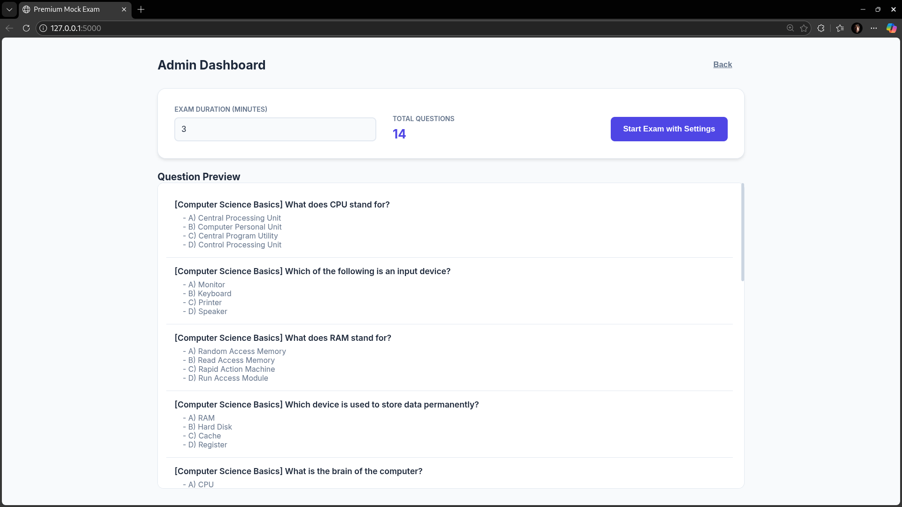
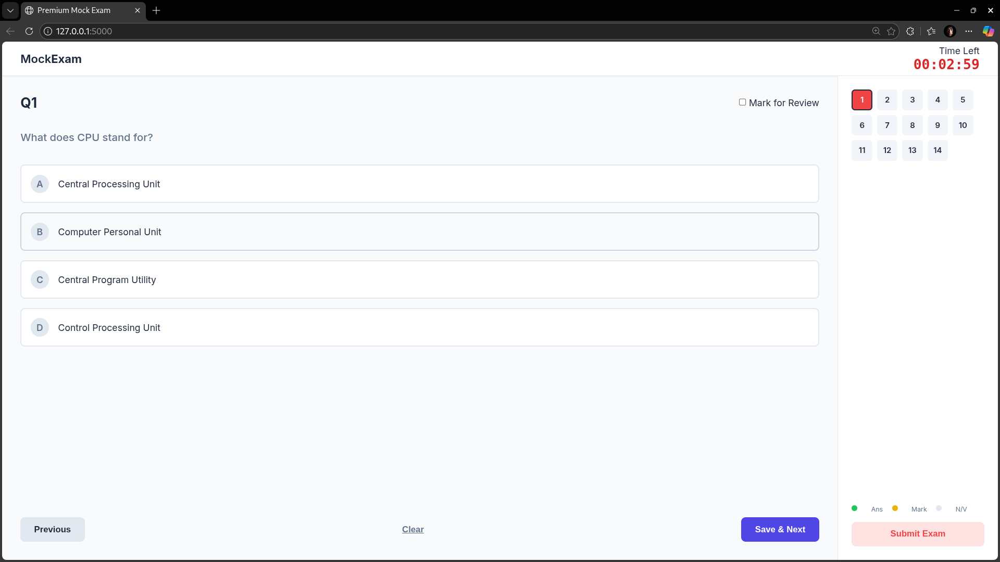
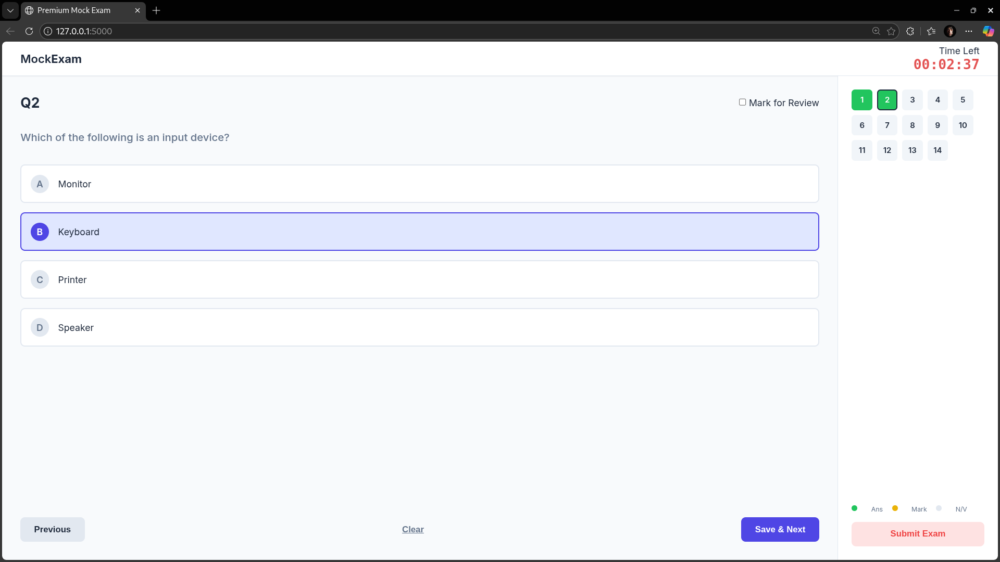
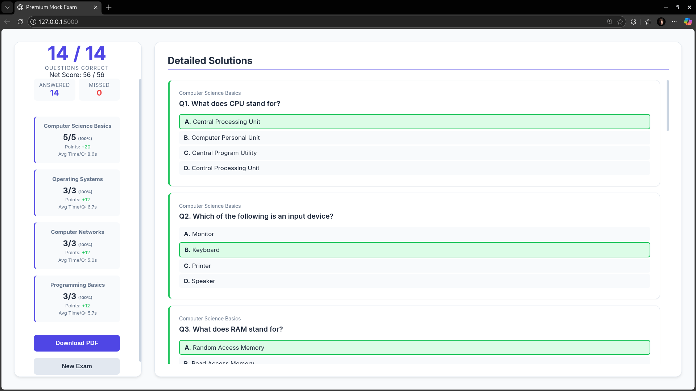
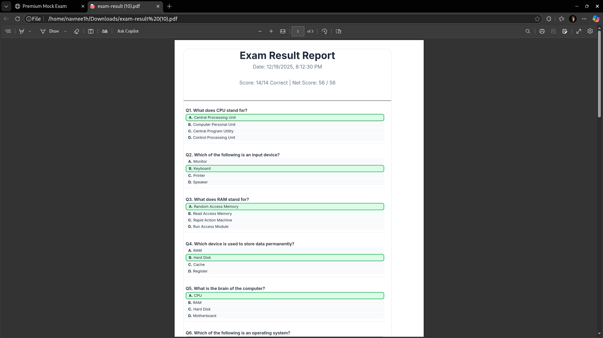

# Personal Mock Exam App

A personal Flask based application created to practice for competitive exams and analyze my performance.

Supports custom questions fed as Markdown files and simulates real exam conditions.

---

##  Screenshots

  

